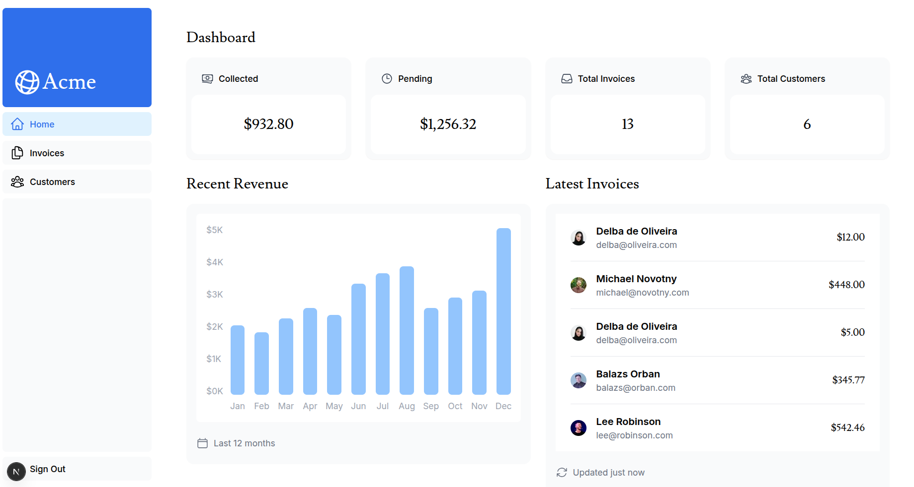
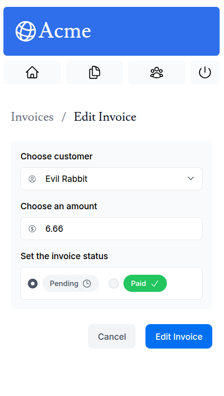

# Invoice Dashboard

A full-stack financial dashboard built with Next.js 15.




## Features

- **Dashboard Overview**: Interactive cards displaying key metrics and revenue charts
- **Invoice Management**: Complete CRUD operations for managing customer invoices
- **Customer Management**: View and manage customer data with pagination
- **User Authentication**: Secure login system with NextAuth.js
- **Database Integration**: PostgreSQL database with Vercel Postgres
- **Responsive Design**: Mobile-first design using Tailwind CSS
- **Form Validation**: Client and server-side validation with Zod
- **Search & Pagination**: Advanced data filtering and navigation
- **Loading States**: Skeleton components and streaming for better UX

## Project Structure

```
app/
├── dashboard/           # Protected dashboard pages
│   ├── (overview)/      # Dashboard home
│   ├── customers/       # Customer management
│   └── invoices/        # Invoice CRUD operations
├── lib/                 # Utilities and data fetching
│   ├── actions.ts       # Server actions
│   ├── data.ts          # Database queries
│   └── definitions.ts   # TypeScript type definitions
├── login/               # Authentication pages
└── ui/                  # Reusable UI components
    ├── dashboard/       # Dashboard-specific components
    ├── invoices/        # Invoice-related components
    └── customers/       # Customer-related components
```

## Getting Started

### Prerequisites

- Node.js ^20
- pnpm package manager
- PostgreSQL database (Vercel Postgres recommended)

### Installation

1. Clone this repository
2. Install dependencies:
   ```bash
   pnpm install
   ```

3. Set up environment variables (create `.env.local`):
   ```
   POSTGRES_URL=your_postgres_connection_string
   AUTH_SECRET=your_auth_secret
   ```

4. Start dev server:
    ```bash
    pnpm dev
    ```

4. Seed the database:
   ```bash
   # Visit /seed route to populate sample data
   ```

## Demo Login
Use the following credentials to try it out:

user [at] nextmail [dot] com  
123456

## Key Features Implementation

- **Server Components**: Leverages Next.js App Router for server-side rendering
- **Streaming**: Uses React Suspense for progressive page loading
- **Server Actions**: Form handling with Next.js server actions
- **Route Protection**: Middleware-based authentication guards
- **Optimistic Updates**: Immediate UI feedback for user actions
- **Error Boundaries**: Graceful error handling with custom error pages
- **SEO Optimization**: Proper metadata and Open Graph images

---

*The project is part of the Next.js learning course and demonstrates best practices for building production-ready web applications.*
